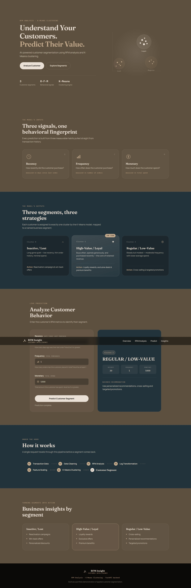

# Customer Segmentation using RFM Analysis & K-Means

<p align="center">
  
</p>

<p align="center">
  <strong>RFM Analysis | K-Means Clustering | Unsupervised Learning | FastAPI | Machine Learning</strong>
</p>

---

## Project Overview

Customer Segmentation is an end-to-end Machine Learning project designed to analyze customer purchasing behavior and divide customers into meaningful business segments.

The project uses:

- Recency
- Frequency
- Monetary (RFM) Analysis
- Log Transformation
- Feature Scaling
- K-Means Clustering
- Scikit-Learn Pipeline
- FastAPI
- Pydantic
- HTML / CSS / JavaScript

The main objective is to transform raw online retail transaction data into actionable customer insights that can support targeted marketing, customer retention, loyalty programs, and reactivation campaigns.

---

## Business Problem

Online retail companies generate a large amount of transactional data every day.

However, raw transaction data does not directly answer important business questions such as:

- Which customers are highly valuable?
- Which customers have stopped purchasing?
- Which customers purchase regularly but spend less?
- Which customers should receive loyalty rewards?
- Which customers need reactivation campaigns?
- How can marketing strategies be personalized for different customer groups?

This project solves this problem by using customer purchasing behavior to create meaningful customer segments.

---

## Project Objective

The major objectives of this project are:

- Clean and preprocess raw retail transaction data.
- Perform exploratory data analysis.
- Calculate customer-level RFM features.
- Analyze the distribution and skewness of RFM features.
- Apply log transformation where required.
- Standardize the features.
- Build a Scikit-Learn Machine Learning pipeline.
- Determine a suitable number of clusters.
- Apply K-Means clustering.
- Evaluate clustering quality using Silhouette Score.
- Compare clustering approaches such as Hierarchical Clustering and DBSCAN.
- Profile customer segments.
- Convert ML clusters into meaningful business segments.
- Build an API for real-time customer segmentation.
- Provide business recommendations for each customer segment.

---

# Dataset

The project uses the **Online Retail II** transactional dataset.

The dataset contains historical online retail transactions including information such as:

- Invoice
- Stock Code
- Description
- Quantity
- Invoice Date
- Price
- Customer ID
- Country

The raw transaction-level data is transformed into customer-level behavioral features.

---

# RFM Analysis

RFM stands for:

### Recency

Measures how recently a customer made a purchase.

```text
Recency = Days since customer's last purchase
